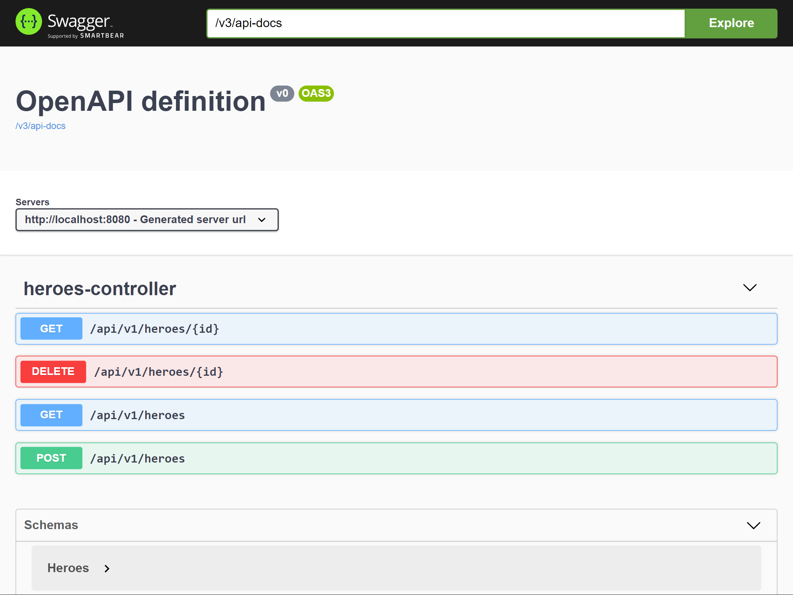

# Digital Innovation One

## Criando um gerenciador de super heróis Marvel e DC Comics em uma API reativa com Spring WebFlux

Nesse projeto foi desenvolvida uma API de gerenciamento de heróis utilizando **Spring WebFlux**, utilizada por empresas como Netflix e Pivotal, junto com a library reativa Reactor que atualmente é mantida pela VmWare.

Além de utilizar o **DynamoDB** localmente para armazenar os dados, também foram criados testes unitários da API com **JUnit**, e a documentação da API com o **Swagger**.

---

### 📝 Instruções

1. Instalar o [AWS CLI][aws-cli] e, em seguida, configurar através do comando abaixo:

    ```console
    aws configure
    ```

2. Instalar o [AWS DynamoDB local][aws-local-dynamodb].
3. Executar o **DynamoDB** local com o seguinte comando:
   
   ```console
   java -Djava.library.path=./DynamoDBLocal_lib -jar DynamoDBLocal.jar -sharedDb
   ```

4. Executar o método principal das seguintes classes:

   - ```config/HeroesTable```: para criar a tabela no DynamoDB.
   - ```config/HeroesData```: para inserir dados de teste na tabela.
    
5. Executar a aplicação **Spring Boot** e acessar o *endpoint*: ```http://localhost:8080/api/v1/heroes```
   


6. Executar os tests unitários do **JUnit** na classe ```HeroesApiApplicationTests```.
---

### 📑 Swagger - API Docs

Para visualizar a documentação da API no **Swagger**, acesse o endereço: ```http://localhost:8080/swagger-ui-heroes-reactive-api.html```



---

### 🛠 AWS CLI  - Comandos úteis:

- Confirmar a criação do banco de dados local:

    ```console
    aws dynamodb list-tables --endpoint-url http://localhost:8000
    ```
   
   ```console
   aws dynamodb describe-table --table-name HeroesCollection --endpoint-url http://localhost:8000
   ```

- Listar os documentos no banco de dados:

   ```console
   aws dynamodb scan --table-name HeroesCollection --endpoint-url http://localhost:8000
   ```

---

### 📚 Referências

- [Spring WebFlux][spring-webflux]
- [JUnit][junit]
- [Swagger][swagger]

[aws-cli]:https://aws.amazon.com/pt/cli/
[aws-local-dynamodb]:https://docs.aws.amazon.com/pt_br/amazondynamodb/latest/developerguide/DynamoDBLocal.DownloadingAndRunning.html
[spring-webflux]:https://docs.spring.io/spring-framework/docs/current/reference/html/web-reactive.html#webflux
[junit]:https://junit.org/
[swagger]:https://swagger.io/